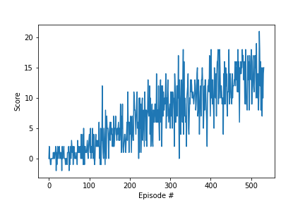
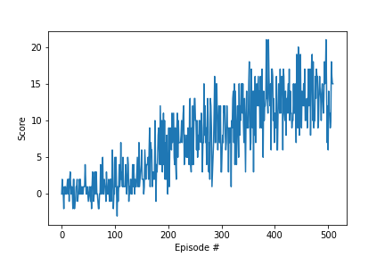
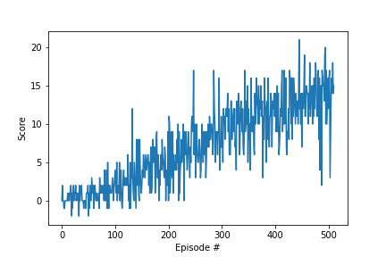
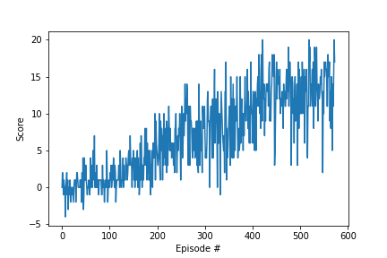

# Project 1: Navigation

## Introduction
This is a really interesting project to collect as many as bananas:)

I implemented Deep Q network, Double deep Q network, Dueling deep Q network
as well as prioritized memory replay. 

I compared their performance and got some interesting intuitions for them.

## Learning algorithms
### Shared hyper-parameters
Theses hyper-parameters are used for all learning algorithms.

| hyper-parameters        | Value           | 
| ------------- | -------------| 
| mini batch size      | 64 | 
| discount factor      | 0.99      |   
| TAU for soft update of target parameters| 1e-3    |   
| learning rate | 5e-4    |   
| how often to update the network | 4    |  

### Deep Q network
The core idea of deep Q network is to estimate Q value by a neural network. 

Two techniques are extremely useful: 
- Experience replay makes RL similar to supervised learning.
- Seperating the online network and target network reduces the oscillations of learning.  

Its algorithm is described here:

In my work, I used a three-layer fully connected neural network to approximate the Q value function. 
RELU is the activation function.
Network architecture is:
- Input layer size: 37
- Hidden layer 1 size: 256
- Hidden layer 2 size: 128
- Output layer size: 4

### Double deep Q-network
Different from vanilla DQN, double DQN uses the online network to greedily select the next action, 
while the target network is used to evaluate the next state's q value. 

The neutral network has the same architecture as it of DQN.

### Dueling deep Q network
The neutral network has the same architecture as it of DQN except the last layer. 
Value estimator network architecture is:
- Input layer size: 37
- Hidden layer 1 size: 256
- Hidden layer 2 size: 128
- Output layer size: 1

Advantage estimator network architecture is:
- Input layer size: 37
- Hidden layer 1 size: 256
- Hidden layer 2 size: 128
- Output layer size: 4

Finally, through a special aggregation layer to get an estimate of Q(s,a).

### Double deep Q network with prioritized memory replay
I implemented the prioritized memory replay coupled with Double DQN. 
I tested it with parameters (in the following table) for a uniform replay and it worked well. 

| parameters    | Value   | 
| ------------- | -------------| 
| alpha      | 0 | 
| beta      | 0  |   
| beta_increment_per_sampling| 0  | 

However, when I tried prioritized memory replay (e.g. alpha = 0.6, beta = 0.4, beta_increment_per_sampling
= 0.001), the average reward could never reach 13.

## Experiment results
Deep Q-network solved the environment in **379** episodes with	average Score: 13.00

Double DQN solved the environment in **410** episodes with average Score: 13.03

Dueling DQN solved the environment in **411** episodes with average Score: 13.02

Double DQN with prioritized memory solved the environment in **473** episodes with average Score: 13.01

## summary
I got sunrising results that vanilla DQN slightly outperforms double/dulling DQN with the my parameter configuration.
It seems that in this project the number of hidden units has major influence on the result.

Here are some of my intuitions when each enhanced algorithm is useful.

| Problem        | Algorithm           | Example  |
| ------------- |:-------------:| -----:|
| Overestimate of Q value      | Double DQN | Pendulum-v0 |
| Some transitions with high rewards are rare in memory     | prioritized memory replay      |   MountainCarContinuous-v0 |
| Actions in most time do not influence Q value | Deuling DQN      |  Atari Enduro |

## Ideas for Future Work
It will be interesting and challenging to train an agent from RGB images.

## Questions for the reviewer
Could you check wether my implementation of prioritized memory replay is correct? 

I tested it with parameters (alpha = 0, beta = 0, beta_increment_per_sampling
= 0) for a uniform replay and it worked well. 

However, when I tried prioritized memory replay (e.g. alpha = 0.6, beta = 0.4, beta_increment_per_sampling
= 0.001), the average reward could never reach 13.

### Reference paper
- [DQN](http://files.davidqiu.com//research/nature14236.pdf)
- [Double DQN](https://arxiv.org/abs/1509.06461)
- [Dueling DQN](https://arxiv.org/abs/1511.06581)
- [Prioritized memory replay](https://arxiv.org/abs/1511.05952)

